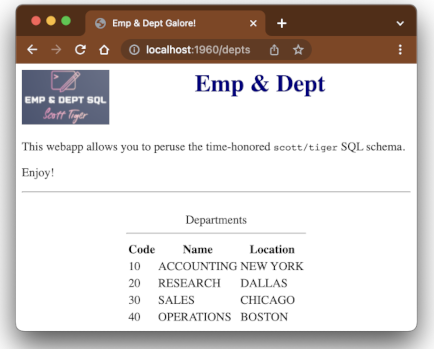

# Query Publisher

Publish your SQL queries on the web with simple Pug templates.
No programming required! 😀💃

Show [off] this:



with just this:
```yaml
port: 1960
pageHeader:
  title: Emp & Dept Galore!
  content: |
    img(src='logo.png', style='float: left;')
    h1(style='text-align: center; color: navy').
      Emp & Dept
    br(style='clear: both')
    p.
      This webapp allows you to peruse the time-honored
      #[code scott/tiger] SQL schema. 
    p Enjoy!
routes:
  depts:
    sql: SELECT * FROM dept ORDER BY deptno
    template: |
      table(style='margin: 0 auto;')
        caption
          span Departments
          hr
        tr
          th Code
          th Name
          th Location
        for row in rows
          tr
            td #{row.deptno}
            td #{row.dname}
            td #{row.loc}
database:
  className: 'org.h2.Driver'
  url: 'jdbc:h2:mem:test'
  user: sa
```
